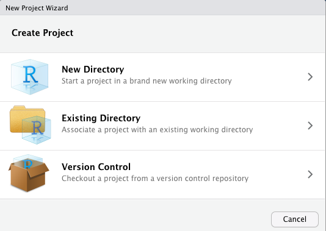
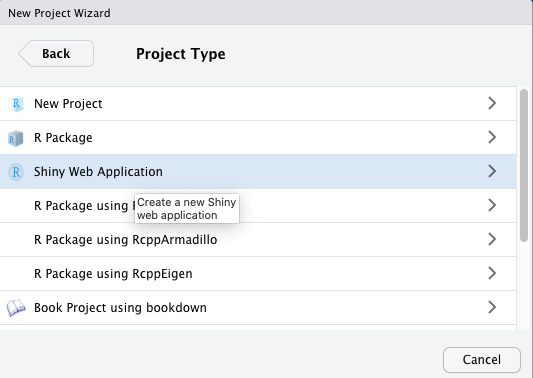
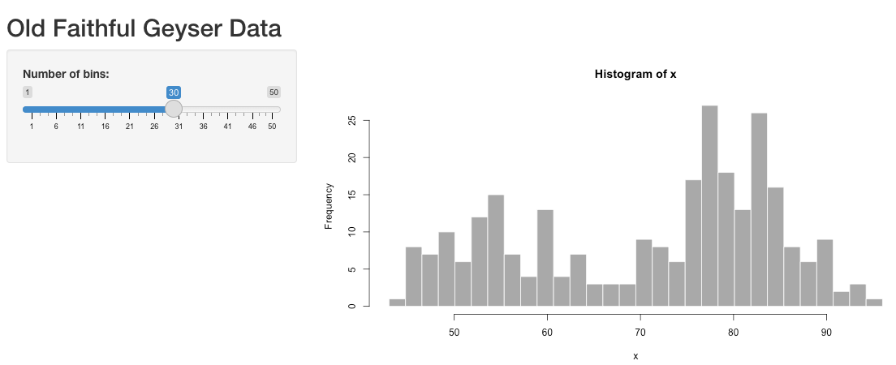
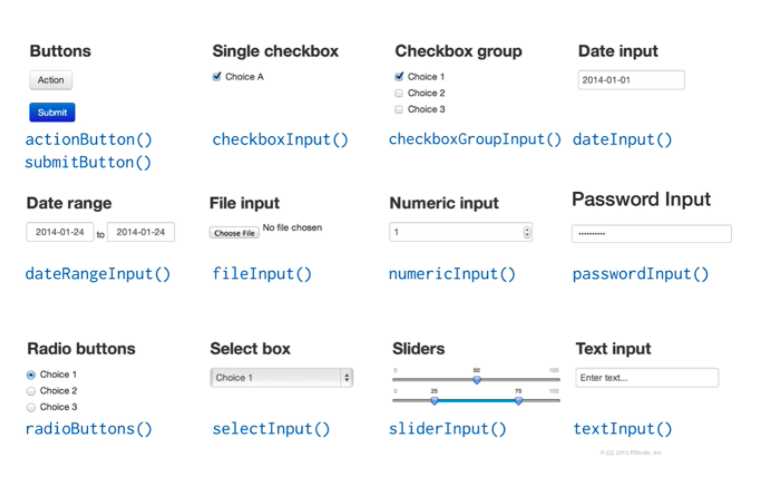
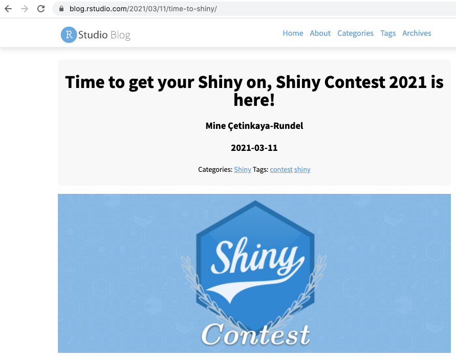

```{r xaringan-themer, include=FALSE, warning=FALSE}
library(xaringanthemer)
style_mono_light(
  base_color = "#042856", 
  header_color = "#7cacd4",
  title_slide_text_color = "#7cacd4",
  link_color = "#0000FF",
  text_color = "#000000",
  background_color = "#FFFFFF",
  header_h1_font_size ="2.00rem"
  )
```


```{r, echo=FALSE, purl=FALSE, message = FALSE}
knitr::opts_chunk$set(comment = "#>", purl = FALSE, fig.showtext = TRUE, retina = 2)
```


```{r xaringan-scribble, echo=FALSE}
xaringanExtra::use_scribble() #activate for the pencil
xaringanExtra::use_xaringan_extra(c("tile_view", "animate_css", "tachyons"))
xaringanExtra::use_panelset() #panel set
```


class: left

# Outline

* Introduction to `Shiny` package.  
* Examples.

---

- Please visit the [NASA Earth Data's Covid-19 Dashboard](
https://earthdata.nasa.gov/covid19/explore/be?map=116.345%2C39.9954%2C8.94&date=2021-02-01&lState=nightlights-hd%7C0%7C0).

```{r, echo=FALSE, out.width="100%"}

```

---
class: center, middle

```{r, echo=FALSE, out.width="35%"}
knitr::include_graphics("logo/rshiny.png")
```

---
#### Shiny package
-  [R Shiny](https://shiny.rstudio.com/) is an `R` package that provides elegant and powerful web framework for **building interactive web applications (apps)** directly from `R`.
- You can host standalone apps on a **webpage** or build **dashboards**. 
- Shiny applications are automatically live and outputs change instantly as users modify inputs, without requiring a reload of the browser.
- You can also extend your Shiny apps with [CSS themes](http://rstudio.github.io/shinythemes/?_ga=2.128822476.1106871023.1621587722-51308884.1621587722), [htmlwidgets](http://www.htmlwidgets.org/), and [JavaScript](https://github.com/daattali/shinyjs/blob/master/README.md) actions.
- To install and load the package:

```{r}
#install.packages("shiny")
library(shiny)
```

---
- Let's see a few quick **built-in** `R Shiny` examples available:

```{r, eval=F}
library(shiny)
runExample("01_hello")  # a histogram  # slider widget
```

```{r, eval=F}
library(shiny)
runExample("02_text")   # tables and data frames  #select box and numeric input widgets
```

```{r, eval=F}
library(shiny)
runExample("06_tabsets")    # tabbed panels  #radio buttons and slider widgets
```

---
- Here is how `R Shiny` works at first sight:

```{r, echo=FALSE, out.width="60%"}

```

---
#### Create a Demo App
- In `RStudio`, go to `File` menu, choose `New Project`. 
- You will see a pop-up window like the one below. Choose `New Directory`.


```{r, echo=FALSE, out.width="60%"}

```

---
- Choose `Shiny Web Application` as the project type.


```{r, echo=FALSE, out.width="60%"}

```


---
- Give a `directory name` such as `demo` for your app and save it.


```{r, echo=FALSE, out.width="60%"}
knitr::include_graphics("images/directory.png")
```


---
- Your `RStudio interface` should look like below now. 
- Click on `Run App` in the top right corner of the `source pane`. 

```{r, echo=FALSE, out.width="80%"}

```

---
- The app will open up in a new window. 
- Play with the `slider` and watch the histogram change.

```{r, echo=FALSE, out.width="60%"}
knitr::include_graphics("images/demo_app.png")
```

- We can also open up the app in a web browser by clicking on `Open in Browser`.

---
#### Shiny app structure
- Now go back to `app.R`, which is the source code of `Shiny` app.
- We can see that `Shiny` app:
   - calls `library(shiny)` to load the shiny package,
   - has a `ui` (short for user interface) component which defines how the app looks, 
   - has a `server` function which defines how the app works, and 
   - executes `shinyApp(ui, server)` function to construct and start a `Shiny app` from `ui` and `server`.

```{r, eval=F}
library(shiny)

ui <- fluidPage()

## fluidPage {shiny}: Functions for creating fluid page layouts. 
## A fluid page layout consists of rows which in turn include columns. 
## Rows exist for the purpose of making sure their elements appear 
## on the same line (if the browser has adequate width). 

##Other layout functions: fillPage(), fixedPage(), flowLayout(), 
##navbarPage(), sidebarLayout(), splitLayout(), verticalLayout()

server <- function(input, output) {}

shinyApp(ui = ui, server = server)
```


---
#### User Interface (UI) structure
- The `ui` part of `Shiny`  app includes a few new functions: 
  - [fluidPage()](https://shiny.rstudio.com/reference/shiny/0.14/fluidPage.html): is a layout function that sets up the basic visual structure of the page.
  - `titlePanel()`: for title of the panel.
  - [sidebarLayout()](https://shiny.rstudio.com/reference/shiny/0.14/sidebarLayout.html): for providing a sidebar for inputs and a large main area for output. 

```{r, eval=F}
# Define UI for application 
ui <- fluidPage(

  # Application title
  titlePanel("Panel Title"),

  # Application main window 
  sidebarLayout(
          
         # Application sidebar panel appearance
         # The sidebarPanel() containing input controls.
         sidebarPanel(
         #####Input widgets come here    
         ),

         # Main panel as output
         # The mainPanel() containing outputs.
         mainPanel(
         #####Output come here  
         )
  )
)

```

---
#### Re-visit demo app
- By default, the sidebar takes up 1/3 of the width, and the main panel 2/3. 
```{css echo=FALSE}
.pull-left {
  float: left;
  width: 48%;
  
}
.pull-right {
  float: right;
  width: 48%;
  heigth: 100%;
}
```

.pull-left[
```{r, eval=F}
# Define UI for application that draws a histogram
ui <- fluidPage(
    # Application title
    titlePanel("Old Faithful Geyser Data"),

    sidebarLayout(
     
      # Sidebar with a slider input for number of bins 
        sidebarPanel(

            sliderInput("bins",
                        "Number of bins:",
                        min = 1,
                        max = 50,
                        value = 30)
        ),
        # Show a plot of the generated distribution
        mainPanel(
           plotOutput("distPlot")
        )
    )
)
```
]

--
.pull-right[

```{r, echo=FALSE, out.width="100%"}

```

]


---
- In the `ui`, the function `sidebarPanel()` draws the panel for sidebar, whereas the function `mainPanel()` draws the main output panel.

```{r, echo=FALSE, out.width="90%"}

```

---
- The function `sidebarPanel()` takes the input, and then the output is produced based on the input value in the sidebar panel.
- The `sliderInput()` tells us that  **input widget** is a horizontal slider which has a single handle that can be moved with the mouse.
- The `plotOutput()` tells us that the produced output will be a plot.

```{css echo=FALSE}
.pull-left {
  float: left;
  width: 48%;
  
}
.pull-right {
  float: right;
  width: 48%;
  heigth: 100%;
}
```

.pull-left[
```{r, eval=F}
ui <- fluidPage(
  
    titlePanel("Old Faithful Geyser Data"),

    sidebarLayout(
      # Sidebar with a slider input for number of bins 
        sidebarPanel(
# sliderInput(inputId,
#             label,
#              min,
#              max,
#              value)
            sliderInput("bins",
                        "Number of bins:",
                        min = 1,
                        max = 50,
                        value = 30)
        ),
        # Show a plot of the generated distribution
        mainPanel(
           plotOutput("distPlot")
        )
    )
)
```
]

--
.pull-right[

```{r, echo=FALSE, out.width="100%"}

```

]
---
#### ui input widgets

- `Shiny` comes with a variety of built in **input widgets** such as: 
 
```{r, echo=FALSE, out.width="70%"}

```

---

- Visit the [Shiny widget gallery](https://shiny.rstudio.com/gallery/widget-gallery.html) for all possible input widgets and their usage.


---
#### ui outputs

- `Shiny` provides a family of functions that turn `R objects` in `server()` into output for `ui`. 
-  Each function below creates a specific type of output for `ui`.
 
|Output function         |Creates      | 
|----------------------- |-------------|
|<span style="color:blue">plotOutput()</span>	         | Plot. |
|<span style="color:blue">tableOutput()</span>	       | Table.      |
|<span style="color:blue">dataTableOutput()</span>    | DataTable.  |
|`htmlOutput()`          | Raw HTML.   |
|`imageOutput()`         | Image.      |
|`textOutput()`          | Text.       |
|`uiOutput()`	           | Raw HTML.   |
|`verbatimTextOutput()`	 | Text.       |


---
#### Server structure
- Next, we need to provide the `R code` in the `server()` function to build the output in the `ui`.
- The `server()` builds a **list-like** **output** and **input** objects that contains all of the code needed to update the `R objects` in our app. 
- Each `R` object needs to have its own entry in the list.


---
#### Re-visit demo app
- We can create an entry by defining a new element for `output` within the `server` function, like below. 
- The element name should match the name of the **reactive element** that we created in the `ui`.

```{r, eval=FALSE}
# Define server logic required to draw a histogram
server <- function(input, output) {

    # generate the histogram plot output
    output$distPlot <- renderPlot({
        # generate bins based on input$bins from ui.R
        x    <- faithful[, 2]
        bins <- seq(min(x), max(x), length.out = input$bins + 1)

        # draw the histogram with the specified number of bins
        hist(x, breaks = bins, col = 'darkgray', border = 'white')
    })
}

```

---
- Each entry to `output` in `server` should contain one of `render*()` functions. 
- Use the `render*()` function that corresponds to the type of **reactive object** you are making.

|Render function        |Creates                                          | 
|-----------------------|-------------------------------------------------|
| <span style="color:blue">renderPlot()</span>        |	Plots.            |
| <span style="color:blue">renderTable()<span style="color:blue">         |	Data frame, matrix, other table like structures.|
| <span style="color:blue">renderDataTable()<span style="color:blue"> 	  | DataTable.                                      |
| `renderImage()`	      | Images (saved as a link to a source file).      | 
| `renderPrint()`	      | Any printed output.                             |
| `renderText()`        |	Character strings.                              |
| `renderUI()`	        | A Shiny tag object or HTML.                     |


- Each `render*()` function takes a single argument: an `R expression` surrounded by braces {} and do some light pre-processing on the expression.

---
- The `R expression` can be one simple line of text, or it can involve many lines of code, as if it were a complicated function call.	
- For this to work, your expression should return the object you have in mind (a piece of text, a plot, a data frame, etc.). You will get an error if the expression does not return an object, or if it returns the wrong type of object.

---
- The outputs in `render*()` of `server` and `*Output()` in `ui` together.

```{r, echo=FALSE, out.width="70%"}

```
---
- Match the input and output objects in `ui` and `server`.

.pull-left[
```{r, eval=F}
# Define UI for application that draws a histogram
ui <- fluidPage(

    # Application title
    titlePanel("Old Faithful Geyser Data"),

    
    sidebarLayout(
      
        # Sidebar with a slider input for number of bins 
        sidebarPanel(
            sliderInput("bins",
                        "Number of bins:",
                        min = 1,
                        max = 50,
                        value = 30)
        ),

        # Show a plot of the generated distribution
        mainPanel(
           plotOutput("distPlot")
        )
    )
)
```
]

.pull-right[
```{r, eval=FALSE}
# Define server logic required to draw a histogram
server <- function(input, output) {

    output$distPlot <- renderPlot({
        # generate bins based on input$bins from ui.R
        x    <- faithful[, 2]
        bins <- seq(min(x), max(x), length.out = input$bins + 1)

        # draw the histogram with the specified number of bins
        hist(x, breaks = bins, col = 'darkgray', border = 'white')
    })
}

```
]

- `input$id` = bins & `output$id` = distPlot. Output is a plot object.
---
#### Run the app: UI + Server

- When ready, launch your `Shiny app` by running:

```{r, eval=FALSE}
# Run the application 
shinyApp(ui = ui, server = server)
```

---
#### Data

- We have a data set named **countries_1998_2011.csv** which is all about a Human Development Index calculated by [United Nations Development Programme](http://hdr.undp.org/en/content/human-development-index-hdi). 

- <span style="color:purple">**The Human Development Index (HDI)** is a summary measure of average achievement in key dimensions of human development: a long and healthy life, being knowledgeable and have a decent standard of living. The HDI is the geometric mean of normalized indices for each of the three dimensions.</span>

```{r, echo=FALSE, out.width="100%"}

```

---

class: middle, center

```{r, echo=FALSE, out.width="100%"}

```

[Source](http://hdr.undp.org/en/content/human-development-index-hdi)

---
- The data set **countries_1998_2011.csv** is available under `data directory`. Please, have a look at it.
- Note that this is an old data set I have found on an arbitrary webpage. For that reason, I am not able to give you the original url address.

```{r, warning=F, message=F}
library(tidyverse)
data <- read_csv("data/countries_1998_2011.csv")
head(data)
```

```{r, eval=F}
View(data)
```

---
#### Example: Countries-01
- Filter the data for the year 2011 and develop a `Shiny` app which enables to select one of variables **human_development_index**, **corruption_perception_index**, **population**, **life_exp**, and **gdp_per_capita** through an  `input widget` to plot the selected variable on the horizontal axis and also enables to select another variable  through another `input widget` to plot that selected variable on the vertical axis.
- Afterwards, get a scatter plot of the selected two variables and identify the points by their **continent type** by assigning different **colors**.
                   
---
class: middle, center


```{r, echo=FALSE, out.width="100%"}
knitr::include_graphics("images/fig1.png")
```


---
class: middle, center

```{r, echo=FALSE, out.width="100%"}

```


---
#### SelectInput Widget
- This question requires to use the `selectInput` widget in the `ui`:

- **Usage**: 

```{r, eval=F}
selectInput(
  inputId,
  label,
  choices,
  selected = NULL
)
```

- **Arguments**:
 - `inputId`: The input slot that will be used to access the value.	
 - `label`: Display label for the control, or NULL for no label. 	
 - `choices`: List of values to select from.	
 - `selected`: The initially selected value.	

- **Value**: A select list control that can be added to a UI definition.

---

⚠️ Not happy with axis labels? Please read the help page below:

https://community.rstudio.com/t/reactive-axis-labels-in-shiny-with-ggplot-display-user-selected-label-not-variable-name/17560

---
#### Example: Countries-02
- Now, add a third **select variable** for **point size** in the scatter plot with choices "population", "life_exp", "gdp_per_capita".
- Use this variable in the aesthetics of the `ggplot` function as the `point size` argument.

```{r, echo=FALSE, out.width="100%"}

```

---
#### Example: Countries-03
- Add a **SliderInput** with range [0-1] with a **default value** at 0.8.
- Pass this variable to the `alpha` argument in the `geom_point()` function.

```{r, echo=FALSE, out.width="100%"}
knitr::include_graphics("images/transparency.png")
```

---
#### SliderInput Widget
- This question requires to use the `sliderInput` widget in the `ui`:

- **Usage**: 

```{r, eval=F}
sliderInput(
  inputId,
  label,
  min,
  max,
  value
)
```

- **Arguments**:
 - `inputId`: The input slot that will be used to access the value.	
 - `label`: Display label for the control, or NULL for no label. 	
 - `min`: The minimum value (inclusive) that can be selected.	
 - `max`: The maximum value (inclusive) that can be selected.
 - `value`: The initial value of the slider. 	

---
#### Example: Countries-04
- Create a table showing **countries_data_2011** data set.

```{r, echo=FALSE, out.width="100%"}

```
---
#### DT: An R interface to the DataTables library
- The `R` package [DT](https://rstudio.github.io/DT/) provides an `R` interface to the `JavaScript` library [DataTables](https://datatables.net/). 
- `R` data objects (matrices or data frames) can be displayed as tables on `HTML` pages, and `DataTables` provides filtering, pagination, sorting, and many other features in the tables.
- Our question requires to use the `DT::dataTableOutput` widget in the `ui` along with
`DT::renderDataTable` in the `server`.
- We also need to include `library(DT)` at the beginning of the code.


---
#### Example: Countries-05
- Add a `checkboxInput` widget and
the value of the checkbox inside `DT::renderDataTable()` to **show/hide** the data table.

```{r, echo=FALSE, out.width="100%"}

```

---
#### checkboxInput widget
- This question requires to use the `checkboxInput` widget in the `ui`:

- **Usage**: 

```{r, eval=F}
checkboxInput(inputId, 
              label, 
              value = TRUE)

```

- **Arguments**:
 - `inputId`: The input slot that will be used to access the value.	
 - `label`: Display label for the control, or NULL for no label. 	
 - `value`: The initial value. 	
 
---
#### Example: Countries-06 
- Add interactivity to the plot.

```{r, echo=FALSE, out.width="100%"}

```

---
#### R package plotly

```{r, echo=FALSE, out.width="95%"}

```

[Source](https://plotly-r.com/index.html)
---
- This question requires to use the `plotly::plotlyOutput` in the `ui` along with
`plotly::renderPlotly` in the `server`.
- We have already had a `ggplot` object, we can turn it into a `plotly` object via `ggplotly()` function.
- We also need to include `library(plotly)` at the beginning of the code.

---
#### Reactivity
- **Reactivity** is the relationship between **reactive values** and **reactive functions**: reactive values triggers reactive functions, and let the app instantly update itself whenever the user makes a change.
-  Main reactive functions in `Shiny` is:
   - `render*({})`: creates reactivity by using `input$*` inside `render*({})` functions.
   - `reactive({})`: builds a reactive expression (behaves like the input$*).

---
#### Example: Countries-07
- How would you plot a subset of data corresponding to a certain year?

```{r, echo=FALSE, out.width="100%"}

```

---
- Add a `UI` element for the user to select the year.

```{r, eval=F}
## add select variable for year 
selectInput(inputId = "year", 
            label = "Year",
            choices = unique(countries_data$year),
            selected = 2011)

```

---
- Filter the selected year and return a new dataframe as a **reactive expression** via
`reactive({})`.

```{r, eval=F}
## filter data based on the selected year
countries_subset <- reactive({
   countries_data %>% 
     filter(year == input$year)
  })

```

---
- Use the new dataframe for plotting.

```{r, eval=F}
## create scatter plot 
output$countries_scatter <- renderPlotly({
  p_scatter <- ggplot(data = countries_subset(),
                      aes_string(....))+
    geom_point(....)
    ....
    ggplotly(p_scatter)
})

```

---
#### Example: Countries-08
- Create a new reactive **countries_summary** as a new dataframe with median **gdp_per_capita** and **median life_exp per continent**.
- Modify `DT::renderDataTable` to use **countries_summary**.

```{r, echo=FALSE, out.width="100%"}

```

---
#### Example: Countries-09

- Revisit the latest countries example and present "Plot" and "Data Table" as **panel sets**.

.pull-left[

```{r, echo=FALSE, out.width="100%"}

```
]

.pull-right[
```{r, echo=FALSE, out.width="100%"}

```

]

---
- This question requires to use the `tabsetPanel()` function in the `ui`:

- **Usage**:

```html
tabsetPanel(type="tabs",
tabPanel(title, ...)
)
```

- **Arguments**:
  - `type="tabs"`: Standard tab look
  - `tabPanel`: Create a tab panel that can be included within a `tabsetPanel()`.
     - `title`: Display title for tab.	
     -  ...: UI elements to include within the tab.
     
- There can be multiple `tabPanel()`'s in a `tabsetPanel()`.

---
```{r, eval=F}
tabsetPanel(type = "tabs",
                  tabPanel(title = "Plot",
                           plotlyOutput(outputId = "countries_scatter")),
                  tabPanel(title = "Data",
                           dataTableOutput(outputId = "countries_table"))
      )

```

---
#### htmltools package tags
- We can also embed `HTML`  tags into `ui` part of our `Shiny` app.
- Tags should start with `tags` function.
- Here is the complete tag list available in `htmltools` package.

```{r, eval=F}
#install.packages(htmltools)
library(htmltools)
names(tags)
```

---
- The most commonly used `HTML` tags are:

|R function             |HTML            | 
|------------------|---------------------|
|`h1()`,...,`h6()` | Headers.            |
|`p()`	           | Paragraph.          |
|`em()`            | Italic text.        |
|`strong()`        | Bold text.          |
|`span()`          | Text color.         |
|`a()`             | Hyperlink.          |
|`hr()`            | Horizontal line.    |
|`br()`            | Line break.         |
|`img()`           | Embed image.        |
|`iframe()`        | Embed Video.        |

- More info at https://shiny.rstudio.com/articles/tag-glossary.html.

---
#### Visit hmtl_tag_example for full code

```{r, eval=F}

library(shiny)

# Define UI for application that draws a histogram
ui <- fluidPage(

    ## Main header
    tags$h1("My First Shiny App"),
    
    tags$p(" I love data science."),
    
    ## Un-ordered list
    
    tags$ul(
        tags$li("Tidyverse"), 
        tags$li("Rvest"), 
        tags$li("Shiny")
    ),
    

    ## Tags can be nested.
    
    tags$p(
          "The link to the Shiny website is",
           tags$a(href = "https://www.rstudio.com/shiny/", "rstudio.com/shiny."),
           tags$strong("I strongly recommend that you take a look at it!")
    ),
    
    ## Some line break.
    tags$br(),
        
    ## Include image.
    
    tags$img(src="https://i.vimeocdn.com/video/776716658.webp?mw=1100&mh=619&q=70", width="200", height="200"),
   
    ## Some line break.
    tags$br(),
    
    tags$span(style="color:purple", "Have a good summer!..")
)

# Define server logic required to draw a histogram
server <- function(input, output) {

}

# Run the application 
shinyApp(ui = ui, server = server)

```

---
#### Shiny themes
- The default theme of `Shiny` is **Bootstrap theme**.
- However, we can also easily change the overall appearance of the Shiny application using the R package [shinythemes](https://rstudio.github.io/shinythemes/). 
- Install:

```{r, eval=F}
install.packages("shinythemes")
```
- The possible theme names at https://rstudio.github.io/shinythemes/: cerulean, cosmo, cysborg, darkly, superhero.

- Then, in the `ui`, add `shinytheme("theme name")` to the `fluidPage()` function:

```{r, eval=F}
## ui.R ##
library(shinythemes)

fluidPage(theme = shinytheme("superhero"),
  ...
)
```

---
#### Dash Boards
- You can turn your `Shiny app` completely into a Dash Board.
 
```{r, echo=FALSE, out.width="60%"}
knitr::include_graphics("images/dashboard.png")
```

- Visit [Shiny Dash Board](https://rstudio.github.io/shinydashboard/index.html)
for details.
- Visit also https://github.com/turgayh/Interactive-Migration-Map and
https://taylanbt.shinyapps.io/interactive_turkey_map_-_migration/ for an earlier student project.

---
#### Sharing Shiny apps

```{r, echo=FALSE, out.width="60%"}

```

[Source](https://shiny.rstudio.com/deploy/)

---
#### Shiny Contest

```{r, echo=FALSE, out.width="60%"}

```

[Source](https://blog.rstudio.com/2021/03/11/time-to-shiny/)

---
class: middle, center
#### GitHub Pages

<iframe width="853" height="480" src="https://www.youtube.com/embed/2MsN8gpT6jY" title="YouTube video player" frameborder="0" allow="accelerometer; autoplay; clipboard-write; encrypted-media; gyroscope; picture-in-picture" allowfullscreen></iframe>

- Source on [deploying a react app on Github pages](https://medium.com/mobile-web-dev/how-to-build-and-deploy-a-react-app-to-github-pages-in-less-than-5-minutes-d6c4ffd30f14). 

---
#### Vulnerability index
- Visit the `Shiny` app source code on **vulnerability** at https://github.com/BPSTechServices/vulnerability_weighting_map.

```{r, echo=FALSE, out.width="80%"}

```

[Source](https://github.com/BPSTechServices/vulnerability_weighting_map)

---

- **Vulnerability index** in a community is calculated as a composite index across following indicators:
  - **Education**: The share of adults who do not have a four-year degree (**pct_noba** variable).
  - **Tenure**: The share of households who rent their home (**pct_rent** variable).
  - **Race**: The share of the population identifying as a person of color (**pct_poc** and **pct_underserved_poc**variables).
  - **Income**: The share of households that earn less than 80% of the median family income (MFI)(**median_hh_inc** variable).
  - **Age**: The share of people over 70 (**pct_over_70** variable).
  - **Nutrition**: The share of people (or households) receiving food assistance (**pct_food_stamps** variable).
  - **Computer**: The share of people who has no access to computer (**pct_no_device** variable).
  
```{r, eval=F}
vulnerability <- readRDS("data/acs_vuln_weighting_data.rds")
View(vulnerability)
class(vulnerability)
```

---
- Look at the subset data.

```{r, eval=F, warning=F, message=F}
subset <- vulnerability %>% 
          select("GEOID", "NAME", "pct_noba", 
         "pct_rent", "median_hh_inc", "pct_poc", 
         "pct_underserved_poc","pct_over_70", 
         "pct_food_stamps", "pct_no_device",
         "in_primary_place") 
View(subset)
```

```{r, eval=F}
usage <- cbind(subset$GEOID, subset$NAME, subset$pct_noba,ntile(subset$pct_noba, 100)) %>% View() 

```

---
- Based on this data, create `radioButtons` widget for **in_primary_place** variable, then based
on this selection, create `SliderInput` widgets for "pct_noba", "pct_rent", "median_hh_inc", "pct_poc", 
"pct_underserved_poc","pct_over_70", "pct_food_stamps", "pct_no_device" which are changing between 0 and 5.        
        
         

---
# Attributions
- https://curso-r.github.io/my-first-dashboard-with-shiny-csds2019/#50
- https://psyteachr.github.io/shiny-tutorials/01-first-app.html
- https://github.com/OmaymaS/intro_to_shiny_workshop/tree/master/slides
- https://shiny.rstudio.com/tutorial/
- https://mastering-shiny.org/basic-app.html
- http://zevross.com/blog/2016/04/19/r-powered-web-applications-with-shiny-a-tutorial-and-cheat-sheet-with-40-example-apps/
- https://deanattali.com/blog/building-shiny-apps-tutorial/
- https://github.com/carlos-alberto-silva/weblidar-treetop
- https://infographics.economist.com/2021/job-interactive-data-journalist/


---
class: middle, center

<span style="color:purple">WISH YOU A GOOD FINAL EXAM WEEK & WINTER BREAK!..</span>

<br>

✏️ 📚  ☃️

                               


